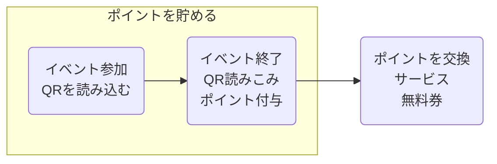

# システム要件定義書

## 0.システム要件
````text
地域活動促進のため、活動に参加すると地域の店で使用できるポイントが貰えるシステムを設計・開発する
各ノードのメリットとしては
* 参加者：ポイントをサービスや無料券と引き換えられる
* 自治体：地域活動への参加者が増える
* 加盟店：ポイントの引き換えによる来店者が増える
事が挙げられる


````

---

## 1. システム構成・シナリオ

### ユーザー ～ポイントを貯める～



### 管理者

**A. ポイント付与対応フロー**

1. (ポイント付与に不備 / 連絡を受ける)
2. (Webアプリにログイン)
3. (参加時間確認)
4. (修正)

**B. 加盟店追加フロー**

1. (新たな加盟店)
2. (ログイン)
3. (店・サービス情報追加)

---

## 2. 機能要件

### Web app

* DBにログイン・操作

### スマホ app

* QRからイベント情報を取得・サーバーに送信
* ユーザーの情報（保有ポイント等）を表示
* (スマホからイベントに登録)
* ポイントをサービスに交換

### サーバー

* (イベントの受付)
* スマホから受け取った情報を元にDBを更新
* 一定期間参加していないユーザーのポイントを失効させる
* (分析)

---

## 4. システム構成

```text
      [ PC ]                     ( サーバー )                  ( スマホ )
    管理者用                       サーバー                    利用者
    Webアプリ                      サーバー群                  スマホアプリ
       |                              |                            |
       +------------------------------+----------------------------+
                                                                   |
                                                               [ QRコード ]

```

---

## 3. 非機能要件

* Webappへの不正なログインを防止
* ポイントの不正な獲得・利用を防止
* ユーザーの情報を保護
* サーバーの継続的な稼動
* DBの定期的なバックアップ
* 入力された情報の整合性をチェック

## 4. データモデル

### 利用者
* 保有ポイント
* 本名
* ユーザーID
* パスワード
* (年代)
* (参加回数)
* (支援履歴) ※または交換履歴
* 参加時間
* 最終ポイント獲得日

### イベント情報
* イベントID [作業内容ごと]
* イベント毎の付与ポイント値
* (イベントの場所)
* (イベントの日時)
* イベント名

### 加盟店
* 店名
* 提供サービス
* 店名

### 管理者
* 管理者ID
* パスワード

### ポイント取引
* サービスID
* サービス名
* (交換数)
* (交換日時)
